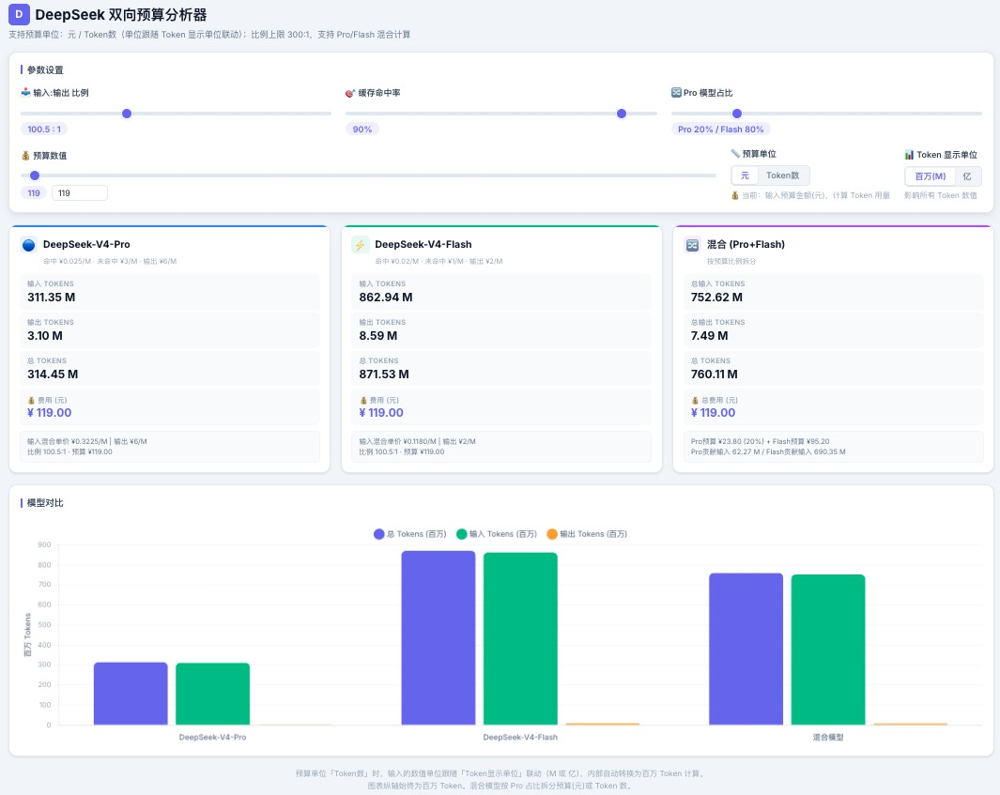
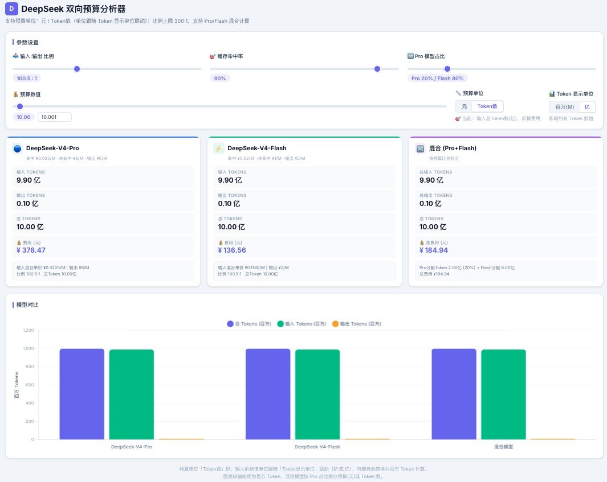

# DeepSeek 双向预算分析器

纯前端单页面工具，用于估算 DeepSeek V4 API 的成本与 Token 用量。

## 功能

- **双向计算**：预算→Token（给定金额算用量）/ Token→费用（给定用量算费用）
- **双模型支持**：DeepSeek-V4-Pro 和 DeepSeek-V4-Flash
- **缓存命中率**：考虑缓存命中/未命中的混合输入单价
- **混合模式**：按比例拆分预算，同时计算 Pro + Flash 的组合用量
- **单位联动**：预算单位（元/Token数）、Token 显示单位（百万/亿）自动联动

## 模型定价

| 模型 | 缓存命中 | 未命中 | 输出 |
|------|---------|--------|------|
| DeepSeek-V4-Pro | ¥0.025/M | ¥3/M | ¥6/M |
| DeepSeek-V4-Flash | ¥0.02/M | ¥1/M | ¥2/M |

## 使用方式

直接用浏览器打开 `deepseek_calculator.html` 即可，无需后端服务。

## 演示

<!-- 截图请放到 docs/ 目录下，并替换下方路径 -->
### 按金额预算计算

### 按token预算计算

---

## DeepSeek Bidirectional Budget Analyzer

A pure frontend single-page tool for estimating DeepSeek V4 API costs and token usage.

### Features

- **Bidirectional calculation**: Budget → Tokens (how many tokens you get for a given budget) / Tokens → Cost (how much a given token count costs)
- **Dual model support**: DeepSeek-V4-Pro and DeepSeek-V4-Flash
- **Cache hit rate**: Accounts for mixed input pricing based on cache hit/miss ratio
- **Hybrid mode**: Split budget proportionally between Pro and Flash models
- **Linked units**: Budget unit (CNY / token count) and display unit (millions / 100-millions) sync automatically

### Pricing

| Model | Cache Hit | Cache Miss | Output |
|-------|-----------|------------|--------|
| DeepSeek-V4-Pro | ¥0.025/M | ¥3/M | ¥6/M |
| DeepSeek-V4-Flash | ¥0.02/M | ¥1/M | ¥2/M |

### Usage

Open `deepseek_calculator.html` directly in your browser — no backend required.

### Screenshots

#### Budget-based calculation

#### Token-based calculation

