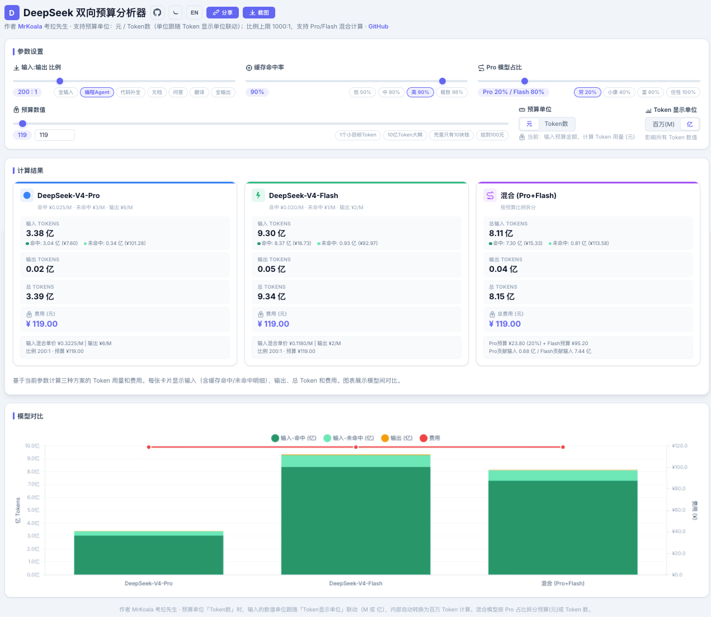
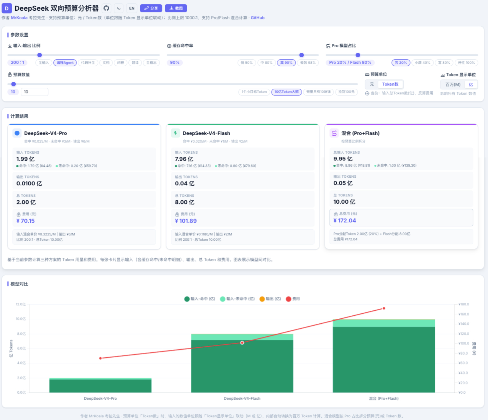
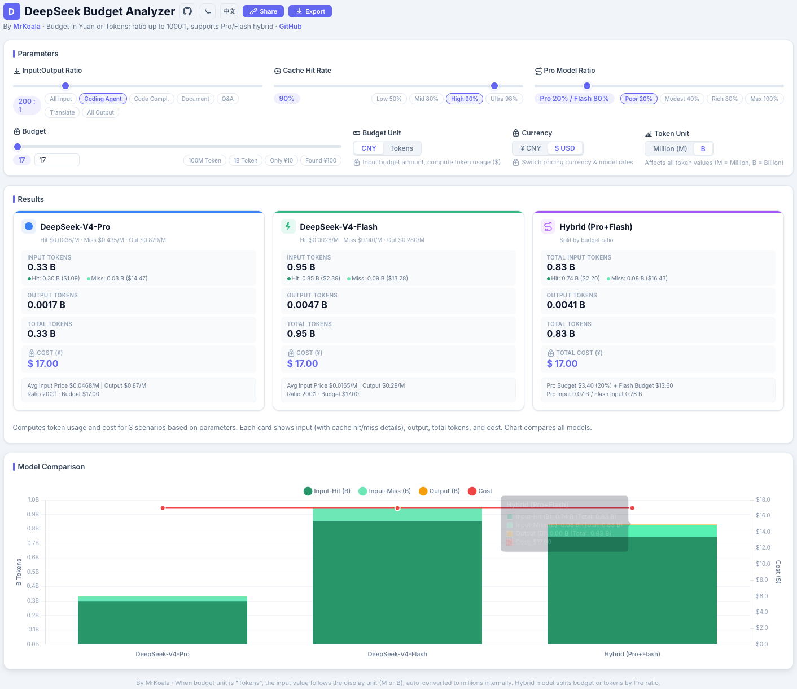
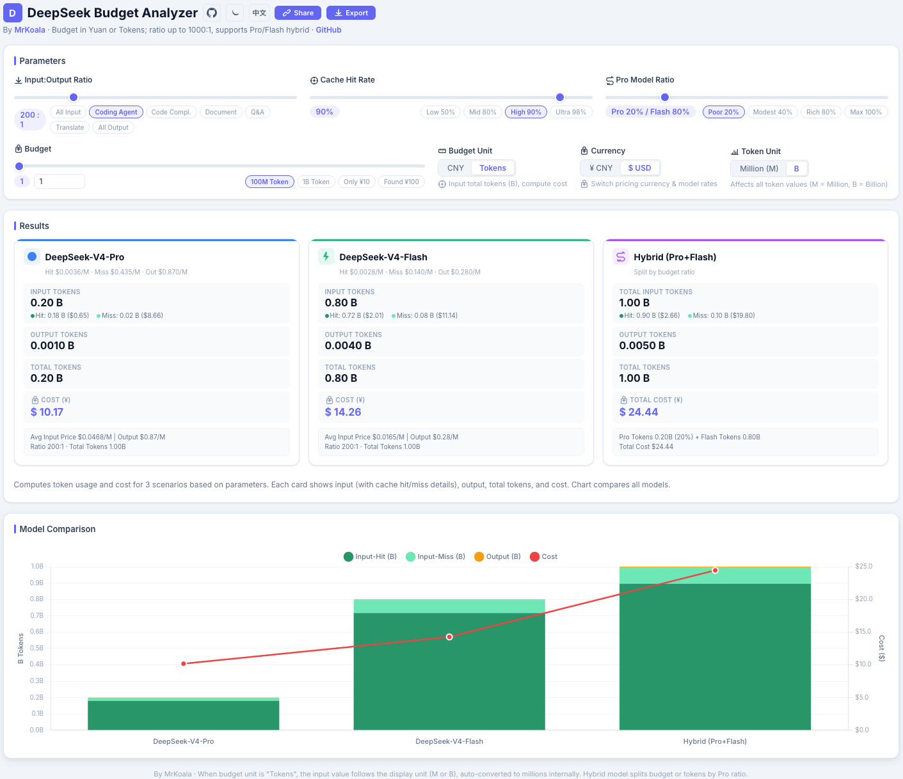

# DeepSeek 双向预算分析器

> 🚀 **在线使用**：[mr-koala.github.io/deepseek-price-calculator](https://mr-koala.github.io/deepseek-price-calculator/deepseek_calculator.html) | 📦 [GitHub 仓库](https://github.com/Mr-Koala/deepseek-price-calculator)

纯前端单页面工具，用于估算 DeepSeek V4 API 的成本与 Token 用量。

## 功能

- **双向计算**：预算→Token（给定金额算用量）/ Token→费用（给定用量算费用）
- **双模型支持**：DeepSeek-V4-Pro 和 DeepSeek-V4-Flash
- **缓存命中率**：考虑缓存命中/未命中的混合输入单价
- **混合模式**：按比例拆分预算，同时计算 Pro + Flash 的组合用量
- **单位联动**：预算单位（元/Token数）、Token 显示单位（百万/亿）自动联动
- **中英文切换**：一键切换 ZH ↔ EN，匹配不同语言用户习惯
- **币种切换**：EN 模式下支持 CNY/USD 切换，价格、计算结果、图表自动更新
- **URL 分享**：所有参数编码在 URL hash 中，一键复制分享链接
- **截图保存**：将当前计算结果导出为 PNG 图片
- **深色模式**：支持亮色/暗色主题切换

## 模型定价

### 人民币定价 (CNY)

| 模型 | 缓存命中 | 未命中 | 输出 |
|------|---------|--------|------|
| DeepSeek-V4-Pro | ¥0.025/M | ¥3/M | ¥6/M |
| DeepSeek-V4-Flash | ¥0.02/M | ¥1/M | ¥2/M |

### 美元定价 (USD)

| 模型 | 缓存命中 | 未命中 | 输出 |
|------|---------|--------|------|
| DeepSeek-V4-Pro | $0.003625/M | $0.435/M | $0.87/M |
| DeepSeek-V4-Flash | $0.0028/M | $0.14/M | $0.28/M |

> 汇率兜底 7.0，页面加载时会尝试获取实时汇率（exchangerate-api.com）。

## 使用方式

直接用浏览器打开 `deepseek_calculator.html` 即可，无需后端服务。

## 演示

### 中文界面

| 按金额预算计算 | 按 Token 预算计算 |
|---------------|------------------|
|  |  |

### English Interface

| Budget → Tokens | Tokens → Cost |
|----------------|---------------|
|  |  |

---

## DeepSeek Bidirectional Budget Analyzer

> 🚀 **Live**: [mr-koala.github.io/deepseek-price-calculator](https://mr-koala.github.io/deepseek-price-calculator/deepseek_calculator.html) | 📦 [GitHub Repo](https://github.com/Mr-Koala/deepseek-price-calculator)

A pure frontend single-page tool for estimating DeepSeek V4 API costs and token usage.

### Features

- **Bidirectional calculation**: Budget → Tokens / Tokens → Cost
- **Dual model support**: DeepSeek-V4-Pro and DeepSeek-V4-Flash
- **Cache hit rate**: Accounts for mixed input pricing based on cache hit/miss ratio
- **Hybrid mode**: Split budget proportionally between Pro and Flash
- **Linked units**: Budget unit (CNY / token count) and display unit (M / B) sync automatically
- **Language toggle**: Switch between ZH and EN
- **Currency toggle**: Switch between CNY and USD in EN mode — prices, results, and charts update instantly
- **URL sharing**: All parameters encoded in URL hash for easy sharing
- **Screenshot export**: Export current results as PNG
- **Dark mode**: Light / dark theme toggle

### Pricing

| Model | Cache Hit | Cache Miss | Output |
|-------|-----------|------------|--------|
| DeepSeek-V4-Pro | ¥0.025/M | ¥3/M | ¥6/M |
| DeepSeek-V4-Flash | ¥0.02/M | ¥1/M | ¥2/M |

#### USD Pricing

| Model | Cache Hit | Cache Miss | Output |
|-------|-----------|------------|--------|
| DeepSeek-V4-Pro | $0.003625/M | $0.435/M | $0.87/M |
| DeepSeek-V4-Flash | $0.0028/M | $0.14/M | $0.28/M |

> Fallback exchange rate: 7.0. On page load, a live rate is fetched from exchangerate-api.com.

### Usage

Open `deepseek_calculator.html` directly in your browser — no backend required.

### Screenshots

#### Chinese (ZH)

| Budget → Tokens | Tokens → Cost |
|---------------|------------------|
|  |  |

#### English (EN)

| Budget → Tokens | Tokens → Cost |
|----------------|---------------|
|  |  |