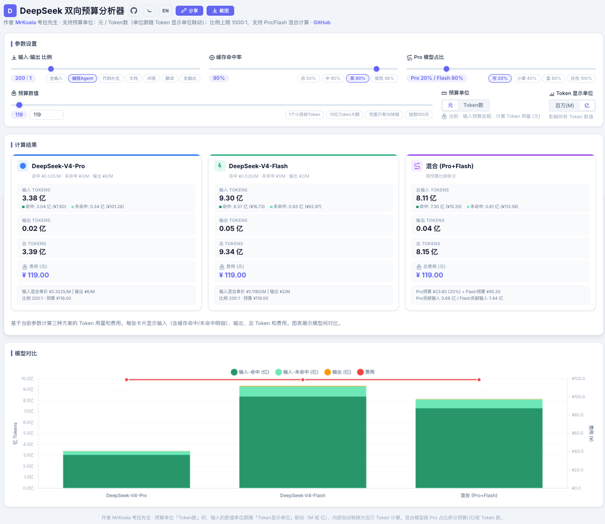
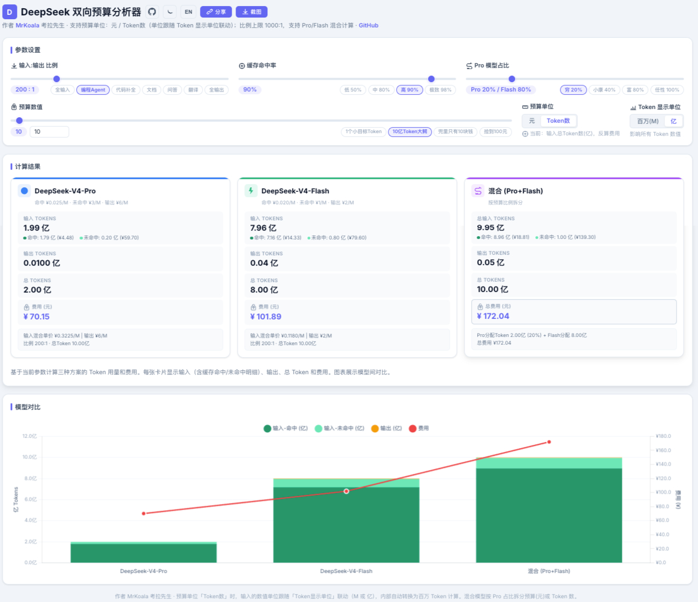
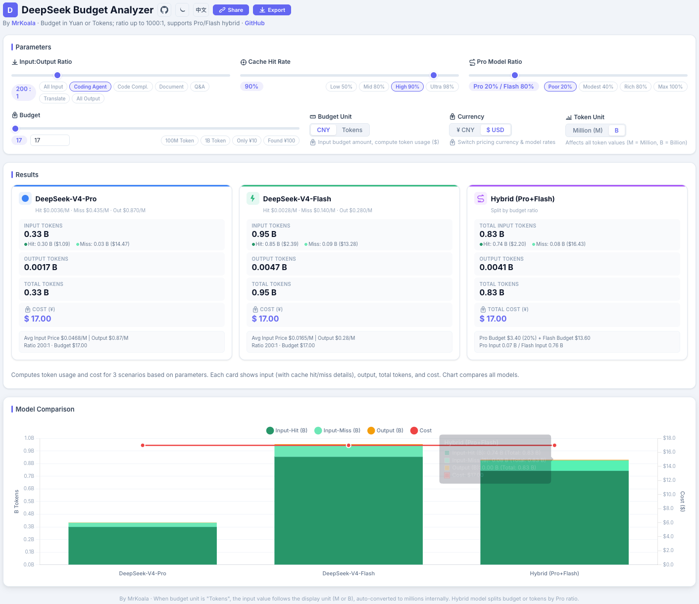
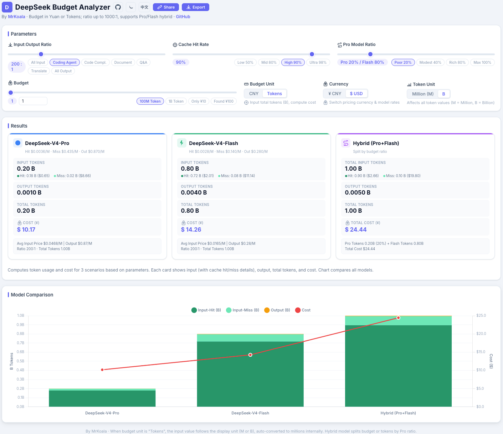

# DeepSeek 双向预算分析器

> 🚀 **在线使用**：[mr-koala.github.io/deepseek-price-calculator](https://mr-koala.github.io/deepseek-price-calculator/deepseek_calculator.html) | 📦 [GitHub 仓库](https://github.com/Mr-Koala/deepseek-price-calculator)

纯前端单页面工具，用于估算 DeepSeek V4 API 的成本与 Token 用量。

## 功能

- **双向计算**：预算→Token（给定金额算用量）/ Token→费用（给定用量算费用）
- **双模型支持**：DeepSeek-V4-Pro 和 DeepSeek-V4-Flash
- **缓存命中率**：考虑缓存命中/未命中的混合输入单价
- **混合模式**：按比例拆分预算，同时计算 Pro + Flash 的组合用量
- **单位联动**：预算单位（元/Token数）、Token 显示单位（百万/亿）自动联动
- **中英文切换**：一键切换 ZH ↔ EN，匹配不同语言用户习惯
- **币种切换**：EN 模式下支持 CNY/USD 切换，价格、计算结果、图表自动更新
- **URL 分享**：所有参数编码在 URL hash 中，一键复制分享链接
- **截图保存**：将当前计算结果导出为 PNG 图片
- **深色模式**：支持亮色/暗色主题切换

## 模型定价

> 数据源：[DeepSeek 官方价格页](https://api-docs.deepseek.com/zh-cn/quick_start/pricing)。DeepSeek 于 **2026-08-17 00:00（北京时间）** 起调整为峰谷定价。本工具内置两套价格，可随时切换。

### 现价（2026-08-17 前）

单位：元 / 百万 tokens，单一计价（无峰谷）。

| 模型 | 缓存命中 | 未命中 | 输出 |
|------|---------|--------|------|
| DeepSeek-V4-Pro | ¥0.025/M | ¥3/M | ¥6/M |
| DeepSeek-V4-Flash | ¥0.02/M | ¥1/M | ¥2/M |

### 新价（2026-08-17 起，峰谷定价）

高峰时段为北京时间 9:00–12:00、14:00–18:00（其余为空闲），**高峰价 = 空闲价 × 2**。

| 模型 | 时段 | 缓存命中 | 未命中 | 输出 |
|------|------|---------|--------|------|
| DeepSeek-V4-Pro | 空闲 | ¥0.15/M | ¥4.5/M | ¥13.5/M |
| DeepSeek-V4-Pro | 高峰 | ¥0.30/M | ¥9/M | ¥27/M |
| DeepSeek-V4-Flash | 空闲 | ¥0.05/M | ¥1.5/M | ¥4.5/M |
| DeepSeek-V4-Flash | 高峰 | ¥0.10/M | ¥3/M | ¥9/M |

> 相比现价，输出 token 在新价空闲时段涨 2.25×、高峰涨 4.5×；缓存命中单价涨幅更大（Flash 2.5×/5×、Pro 6×/12×）。

### 美元定价 (USD)

USD 由 CNY 按实时汇率动态换算（页面加载时从 exchangerate-api.com 获取，兜底汇率 7.0），无需手动维护。

> 版本切换与峰谷占比均会编码进 URL hash，可一键分享。

## 使用方式

直接用浏览器打开 `deepseek_calculator.html` 即可，无需后端服务。

## 演示

### 中文界面

| 按金额预算计算 | 按 Token 预算计算 |
|---------------|------------------|
|  |  |

### English Interface

| Budget → Tokens | Tokens → Cost |
|----------------|---------------|
|  |  |

---

## DeepSeek Bidirectional Budget Analyzer

> 🚀 **Live**: [mr-koala.github.io/deepseek-price-calculator](https://mr-koala.github.io/deepseek-price-calculator/deepseek_calculator.html) | 📦 [GitHub Repo](https://github.com/Mr-Koala/deepseek-price-calculator)

A pure frontend single-page tool for estimating DeepSeek V4 API costs and token usage.

### Features

- **Bidirectional calculation**: Budget → Tokens / Tokens → Cost
- **Dual model support**: DeepSeek-V4-Pro and DeepSeek-V4-Flash
- **Cache hit rate**: Accounts for mixed input pricing based on cache hit/miss ratio
- **Hybrid mode**: Split budget proportionally between Pro and Flash
- **Price version switch**: Toggle between **Current pricing** (in effect before 2026-08-17) and **New peak/off-peak pricing** (effective from 2026-08-17). The default is chosen automatically by current date.
- **Peak/off-peak pricing**: New pricing uses peak hours (9:00–12:00, 14:00–18:00 BJT, price = off-peak × 2); adjust the peak-hour ratio slider for a weighted estimate
- **Linked units**: Budget unit (CNY / token count) and display unit (M / B) sync automatically
- **Language toggle**: Switch between ZH and EN
- **Currency toggle**: Switch between CNY and USD in EN mode — prices, results, and charts update instantly
- **URL sharing**: All parameters encoded in URL hash for easy sharing
- **Screenshot export**: Export current results as PNG
- **Dark mode**: Light / dark theme toggle

### Pricing

> Source: [DeepSeek official pricing page](https://api-docs.deepseek.com/quick_start/pricing). DeepSeek switches to **peak/off-peak pricing** from **2026-08-17 00:00 (BJT)**. This tool ships both price sets, switchable at any time.

#### Current pricing (before 2026-08-17) — flat, no peak/off-peak

| Model | Cache Hit | Cache Miss | Output |
|-------|-----------|------------|--------|
| DeepSeek-V4-Pro | ¥0.025/M | ¥3/M | ¥6/M |
| DeepSeek-V4-Flash | ¥0.02/M | ¥1/M | ¥2/M |

#### New pricing (from 2026-08-17, peak/off-peak)

Peak hours are 9:00–12:00, 14:00–18:00 BJT (rest is off-peak); **peak price = off-peak × 2**.

| Model | Period | Cache Hit | Cache Miss | Output |
|-------|--------|-----------|------------|--------|
| DeepSeek-V4-Pro | Off-peak | ¥0.15/M | ¥4.5/M | ¥13.5/M |
| DeepSeek-V4-Pro | Peak | ¥0.30/M | ¥9/M | ¥27/M |
| DeepSeek-V4-Flash | Off-peak | ¥0.05/M | ¥1.5/M | ¥4.5/M |
| DeepSeek-V4-Flash | Peak | ¥0.10/M | ¥3/M | ¥9/M |

#### USD pricing

USD is derived dynamically from CNY using a live exchange rate (fetched from exchangerate-api.com on load, fallback 7.0), so no manual maintenance is needed.

> Both price-version and peak-ratio are encoded in the URL hash for one-click sharing.

### Usage

Open `deepseek_calculator.html` directly in your browser — no backend required.

### Screenshots

#### Chinese (ZH)

| Budget → Tokens | Tokens → Cost |
|---------------|------------------|
|  |  |

#### English (EN)

| Budget → Tokens | Tokens → Cost |
|----------------|---------------|
|  |  |

## 友链

[linux.do](https://linux.do) — Linux 与开源技术社区

## 许可证

[MIT](LICENSE)